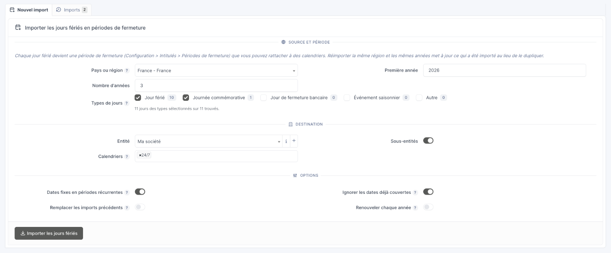
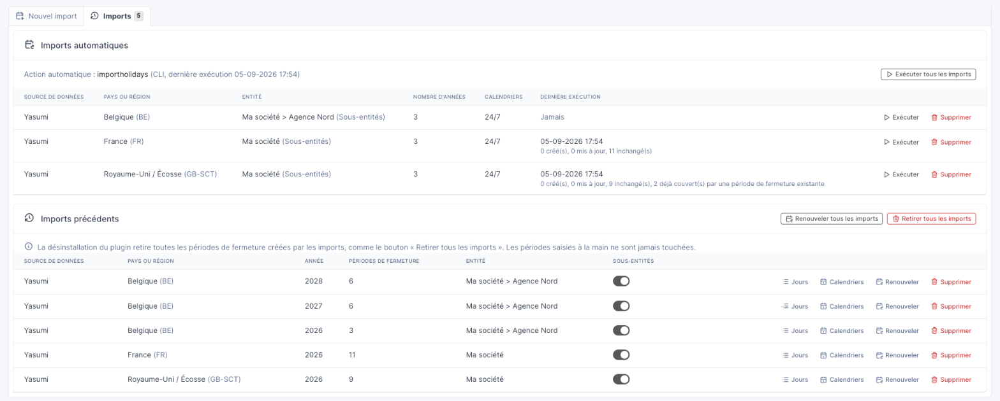
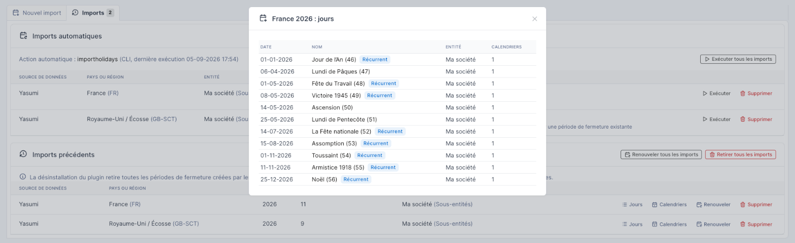
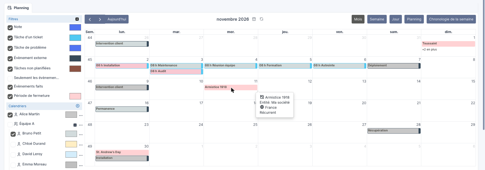

<p align="center">
  
</p>

# Feriae — plugin GLPI

Plugin GLPI 11 **libre et gratuit** qui importe les jours fériés de plus de
150 pays et régions comme **périodes de fermeture** GLPI, les rattache aux
calendriers, les affiche dans le planning et prévient quand une tâche est
planifiée un jour fermé.

Les fériés sont calculés hors ligne par la bibliothèque
[Yasumi](https://github.com/azuyalabs/yasumi) (MIT), complétée par des
règles propres au plugin pour les départements et collectivités d'outre-mer
français. Aucun appel réseau, aucune clé d'API, aucun abonnement.

## Fonctionnalités

- **Import des fériés** depuis *Configuration → Plugins → Feriae* : choix du
  pays ou d'une région (Alsace-Moselle, La Réunion, Écosse, Bavière,
  Tasmanie…), de la première année et du nombre d'années, des types de jours
  (officiels, bancaires, observés…), de l'entité cible et des calendriers à
  compléter. Un compteur à côté de chaque type indique ce que contiennent la
  région et l'année choisies : les sources ne typent pas les fériés de la
  même façon partout (jours « bancaires » au Royaume-Uni, « autres » en
  Suisse), le compteur évite d'importer une liste vide.
- **Périodes de fermeture GLPI standard** : chaque férié devient une entrée
  de *Configuration → Intitulés → Périodes de fermeture*, modifiable ou
  supprimable comme n'importe quelle autre, et prise en compte par les SLA,
  OLA et le calcul des heures ouvrées. Les fériés à date fixe (jour de
  l'An, Noël…) deviennent une seule période **récurrente**, partagée par
  les années importées ; les fériés mobiles (lundi de Pâques, Ascension…)
  restent une période datée par année. Le plugin distingue les deux en
  comparant les années voisines, ce qui laisse datés les jours reportés
  quand ils tombent un week-end, comme le jour de l'An britannique.
- **Import idempotent** : relancer le même import met à jour les périodes
  déjà créées au lieu de les dupliquer, une période supprimée à la main
  n'est pas recréée, et une période existante qui couvre déjà la date (saisie
  à la main ou par un autre import) est réutilisée. L'option *Remplacer les
  imports précédents* permet de repartir de zéro.
- **Import automatique** : l'option *Renouveler chaque année* conserve les
  réglages d'un import. Chaque jour, l'action automatique `importholidays`
  importe le même nombre d'années à partir de l'année en cours, pour chaque
  couple région / entité enregistré : les années à venir sont toujours
  couvertes sans intervention. Les imports automatiques sont listés dans
  l'onglet *Imports* de la page du plugin avec leur dernier résultat.
- **Suivi des imports** : l'onglet *Imports* de la page du plugin liste ce
  qui a été importé par source, région et année, avec le détail des jours de chaque lot (date,
  période de fermeture, entité), la liste des calendriers rattachés, et un
  bouton pour retirer un lot et ses liens aux calendriers, sans toucher aux
  périodes saisies à la main. Une période transférée à la main dans une autre
  entité depuis son import est marquée *Déplacée* dans le détail des jours et
  n'est plus touchée non plus.
- **Planning** : les périodes de fermeture des entités actives apparaissent
  en journée entière dans le planning, avec leur propre filtre et couleur,
  toujours au-dessus des autres événements du jour.
- **Avertissement jour fermé** : un message non bloquant s'affiche quand une
  tâche de ticket, changement ou problème, ou un événement externe du
  planning, est planifié sur une période de fermeture de son entité.
- **Noms traduits** : les fériés prennent le nom de la langue de
  l'utilisateur quand Yasumi la connaît, sinon l'anglais.
- **Sources remplaçables** : Yasumi est utilisé derrière une interface
  `HolidaySource`. Une autre bibliothèque ou un service web peut être ajouté
  sans toucher au reste du plugin.

## Captures d'écran

L'onglet *Nouvel import*, avec les compteurs de types pour la région choisie :



L'onglet *Imports*, avec les imports automatiques et les imports précédents :



Les jours d'un import, avec les périodes récurrentes :



Les périodes de fermeture dans le planning :



## Prérequis

- GLPI >= 11.0
- PHP >= 8.2 avec l'extension `intl`

## Installation

Chaque version est disponible sous forme d'archive sur la page
[Releases](https://github.com/JeremieMercier/feriae/releases). L'archive
embarque déjà Yasumi. Elle s'installe dans le dossier `marketplace/` de
GLPI (le dossier `plugins/` reste réservé au développement).

```bash
# Depuis le dossier marketplace de GLPI, en remplaçant 0.1.0 par la version voulue
cd /chemin/vers/glpi/marketplace

# 1. Télécharger et extraire l'archive (elle contient le dossier feriae/)
curl -LO https://github.com/JeremieMercier/feriae/releases/download/0.1.0/glpi-feriae-0.1.0.tar.bz2
tar -xjf glpi-feriae-0.1.0.tar.bz2 && rm glpi-feriae-0.1.0.tar.bz2

# 2. Donner les fichiers à l'utilisateur du serveur web (www-data, apache, nginx…)
chown -R www-data:www-data feriae

# 3. Installer puis activer le plugin, en ligne de commande…
php ../bin/console plugin:install feriae -u glpi
php ../bin/console plugin:activate feriae
```

… ou depuis l'interface GLPI : *Configuration → Plugins*, boutons
*Installer* puis *Activer* sur la ligne Feriae.

> Le dossier doit s'appeler exactement `marketplace/feriae`. Si une copie du
> plugin existe aussi dans `plugins/feriae`, la supprimer : GLPI n'en charge
> qu'une.

### Mise à jour

Remplacer le dossier `feriae` par le contenu de la nouvelle archive, puis
lancer `php bin/console plugin:install feriae` (ou le bouton *Mettre à jour*
de la page des plugins). Les périodes de fermeture importées et le suivi des
imports sont conservés. Faire tout de même une sauvegarde de la base avant.

### Depuis les sources

Une copie du dépôt git n'embarque pas Yasumi : le plugin refuse alors de
s'installer et le signale. Depuis le dossier du plugin :

```bash
composer install --no-dev
```

## Utilisation

1. *Configuration → Plugins*, icône de configuration sur la ligne Feriae
   (droit *Configuration* en écriture). La page ne montre et ne touche que
   les imports des entités actives de la session : un administrateur
   rattaché à une sous-entité ne voit pas ceux des autres entités et ne
   peut pas agir dessus.
2. Choisir le pays ou la région, la première année et le nombre d'années
   (3 par défaut). Une région listée sous un pays ajoute ses propres fériés
   aux fériés nationaux.
3. Choisir l'entité qui recevra les périodes de fermeture (avec ou sans
   sous-entités) et, si besoin, les calendriers auxquels les rattacher. Seuls
   les calendriers des entités actives sont proposés, pas ceux d'une entité
   parente partagés avec elles : comme dans GLPI, rattacher une période à un
   calendrier demande le droit de le modifier. Sans calendrier, les périodes
   sont créées et pourront être rattachées à la main depuis la fiche du
   calendrier.
4. Mettre *Renouveler chaque année* à *Oui* pour que l'import soit repris
   chaque année par l'action automatique, avec les mêmes réglages. Le
   bouton *Renouveler* sur un import précédent fait pareil après coup, sans
   réimporter, en ne gardant des calendriers liés que ceux que l'on
   pourrait choisir dans le formulaire, et *Renouveler tous les imports* le
   fait pour toutes les régions et entités déjà importées, dans les entités
   de la session.
   L'interrupteur *Sous-entités* d'un import précédent change après coup,
   après confirmation, le partage de ses périodes avec les sous-entités,
   pour toutes les années de la région et de l'entité, car les périodes
   récurrentes sont communes aux années. L'import automatique correspondant
   suit. Une période qu'un calendrier d'une sous-entité utilise reste
   partagée, et le message le dit.
5. *Importer les jours fériés*. Le message de résultat détaille ce qui a été
   créé, mis à jour, laissé tel quel ou réutilisé.

L'action automatique `importholidays` (*Configuration → Actions
automatiques*) tourne une fois par jour ; le bouton *Exécuter tous les
imports* de la page du plugin la lance immédiatement, et le bouton
*Exécuter* d'un import automatique ne lance que celui-là. Quand des imports
automatiques d'autres entités existent hors de la session, le bouton
n'exécute que ceux des entités de la session, sans passer par l'action. Elle est idempotente : une
exécution qui n'a rien à créer ne coûte rien. Retirer un import automatique
depuis la page du plugin arrête le renouvellement sans toucher aux périodes
déjà importées ; retirer un lot importé alors que son import automatique
existe encore le fera recréer à l'exécution suivante.

> **Cron système requis.** Comme GLPI le recommande pour toute action
> automatique, la tâche est enregistrée en **mode CLI** : elle n'est
> exécutée que par le cron système de GLPI, jamais au chargement des pages.
> Assurez-vous donc que la crontab est en place sur le serveur, avec
> l'utilisateur du service web, `GLPI` étant le dossier d'installation :
>
> ```
> * * * * * php GLPI/front/cron.php
> ```
>
> La page du plugin affiche un avertissement quand aucune action en mode CLI
> ne s'est exécutée depuis un jour. Si vous ne souhaitez pas de cron
> système, passez la tâche en mode *GLPI* dans sa fiche : l'import est
> léger et ne ralentit pas les pages.

Les périodes créées sont ensuite des périodes de fermeture GLPI ordinaires :
elles se retrouvent dans *Configuration → Intitulés → Périodes de fermeture*
et dans l'onglet *Périodes de fermeture* des calendriers.

Dans le planning, le filtre *Périodes de fermeture* (droit *Planning* en
lecture) permet de les afficher ou de les masquer et d'en changer la couleur.
La bulle d'un jour affiche son entité, le pays ou la région dont il a été
importé derrière une icône globe (rien pour une période saisie à la main)
et s'il est récurrent.

### Désinstallation

> **La désinstallation retire toutes les périodes de fermeture créées par
> les imports**, avec leurs liens aux calendriers, quelle que soit leur
> entité, comme le bouton *Retirer tous les imports* de la page du plugin le
> fait pour les entités de la session. Une fois le suivi
> du plugin supprimé, plus rien ne permettrait de les distinguer des
> périodes saisies à la main, qui elles ne sont jamais touchées. Une période
> transférée à la main dans une autre entité depuis son import est traitée
> comme saisie à la main : elle reste. Le message de fin de désinstallation
> indique combien de périodes ont été retirées.

Pour ne retirer que certains lots avant de désinstaller, utiliser le bouton
*Supprimer* de la ligne concernée dans *Imports précédents*. La
désinstallation supprime ensuite la configuration, les imports
automatiques, l'action automatique et les tables du plugin.

## Pays et régions

Toutes les régions connues de Yasumi, soit une cinquantaine de pays et leurs
subdivisions quand elles ont des fériés propres (länder allemands, cantons
suisses, états australiens, nations du Royaume-Uni, Alsace-Moselle…).

Pour la France, le plugin ajoute les collectivités d'outre-mer et leurs
jours de commémoration de l'abolition de l'esclavage ou fêtes locales :
Guadeloupe, Martinique, Guyane, La Réunion, Mayotte, Saint-Barthélemy,
Saint-Martin, Saint-Pierre-et-Miquelon, Polynésie française,
Nouvelle-Calédonie, Wallis-et-Futuna.

### Types de jours

Les cinq types proposés à l'import sont ceux de Yasumi, repris tels quels.
Leur usage varie d'un pays à l'autre, d'où les compteurs à côté de chaque
case :

| Type | Ce que Yasumi y range |
|------|-----------------------|
| Jour férié | Jour chômé national ou fédéral. Le type par défaut, utilisé partout. |
| Journée commémorative | Journée célébrée mais non chômée (Fête des mères, Journée nationale de la Résistance…). |
| Jour de fermeture bancaire | Jour de fermeture des banques. C'est le type de presque tous les fériés du Royaume-Uni, dont l'Écosse, ainsi que de la Slovaquie et de quelques jours en Australie et au Canada. |
| Événement saisonnier | Prévu par Yasumi pour les changements d'heure, mais aucun pays ne l'utilise dans la version embarquée (2.11) : la case reste à zéro pour toutes les régions. Elle est conservée au cas où une version future s'en servirait. |
| Autre | Fourre-tout : la plupart des fériés cantonaux suisses, les lendemains de fêtes aux Pays-Bas, quelques jours régionaux en Allemagne, en Grèce et en Espagne. |

## Développement

Le plugin suit l'outillage du
[skeleton officiel](https://github.com/pluginsGLPI/empty) : PSR-4 dans
`src/` sous `GlpiPlugin\Feriae`, tests dans `tests/` sur la base de test
GLPI, phpstan niveau max, php-cs-fixer, twigcs, en-têtes de licence.

```bash
# Dans le dossier du plugin, lié dans plugins/feriae d'une copie de GLPI
composer install
GLPI_ROOT=/chemin/vers/glpi /chemin/vers/glpi/vendor/bin/phpunit
```

Les linters s'appuient sur l'outillage de GLPI, comme le fait la CI : depuis
le dossier de GLPI, `vendor/bin/php-cs-fixer`, `vendor/bin/phpstan`,
`vendor/bin/twigcs` et `node_modules/.bin/eslint` avec les fichiers de
configuration du plugin. Ces fichiers référencent ceux de GLPI par un chemin
relatif (`../../`) : si le plugin est un lien symbolique, faire une copie
locale avec des chemins absolus, par exemple `eslint.config.local.mjs`
(ignoré par git) pour ESLint.

Ajouter une source de fériés revient à implémenter `HolidaySource`
(`src/Source/`) et à l'enregistrer dans `SourceRegistry` depuis
`plugin_init_feriae`.

## Contribuer

- Ouvrir un ticket par bug ou fonctionnalité pour en discuter
- Suivre les [règles de développement GLPI](https://glpi-developer-documentation.readthedocs.io/en/latest/plugins/index.html)
- Travailler sur une branche de votre propre fork et ouvrir une PR

## Licence

MIT. Les données de fériés proviennent de Yasumi (MIT) ; les règles
outre-mer ajoutées par le plugin sont écrites à partir des textes officiels.
Feriae n'a aucun lien avec le plugin « Holidays » de GLPI Network.
